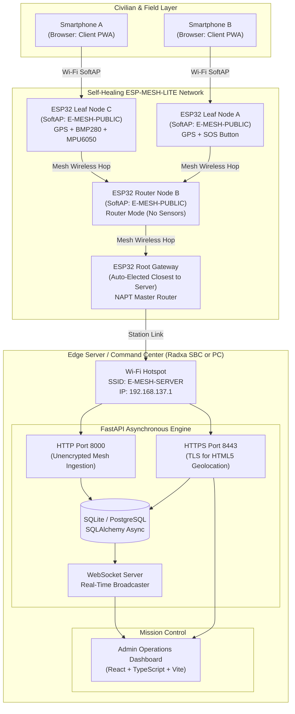
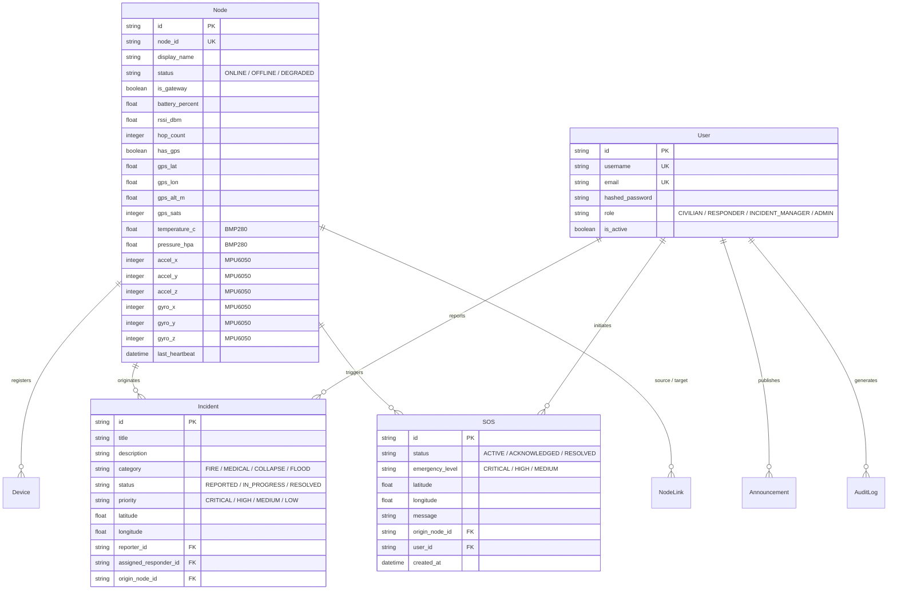

# E-MESH: Emergency Mesh Communication & Disaster Response Platform
## Complete Technical Project Context — Hardware & Software Implementation

---

## 1. Executive Summary & System Overview

**E-MESH** is an infrastructure-independent, self-forming, and self-healing emergency communications network engineered for disaster response and crisis management. During catastrophic events (earthquakes, floods, hurricanes, infrastructure collapse) where commercial cellular towers, fiber backbones, and power grids fail, E-MESH establishes an ad-hoc local wireless network. It enables civilians to send SOS distress signals, report localized incidents, receive emergency announcements, and stream critical environmental telemetry to first responders and incident commanders.

### Key Capabilities
- **Zero External Infrastructure Dependency**: Operates entirely off-grid without requiring cellular service or internet connectivity.
- **Dynamic Self-Healing Mesh**: ESP32 microcontroller nodes form a multi-hop wireless tree topology using Espressif's ESP-MESH-LITE. Nodes automatically elect a root gateway and re-route traffic if intermediate nodes drop.
- **Transparent Client Ingress (NAPT)**: Every node broadcasts an open Wi-Fi SoftAP (`E-MESH-PUBLIC`). Any standard smartphone or laptop can connect without installing specialized apps, with traffic routed across mesh hops via Network Address Port Translation (NAPT).
- **Multi-Sensor Telemetry**: Real-time integration of GPS/GNSS positioning (u-blox NEO-6M / NEO-M8N), barometric pressure & altitude (Bosch BMP280), and 6-axis seismic/structural motion sensing (InvenSense MPU6050).
- **Physical Emergency Interlocks**: Hardware-debounced interrupt-driven SOS pushbuttons paired with pulsed acoustic alarms (active buzzer) and optical beacons (LED).
- **Dual-Stack Edge Server**: Central SBC (Radxa / laptop hotspot) executing an asynchronous FastAPI core with dual HTTP/HTTPS endpoints and real-time WebSocket pub/sub.
- **Real-Time Command Dashboard**: React + TypeScript single-page application providing live network topology graphs, automated node telemetry polling, emergency dispatch queues, and incident management.

---

## 2. High-Level Architecture & Data Flow



---

## 3. Hardware Architecture & Specifications

The E-MESH hardware layer is built around Espressif Systems microcontrollers, combining Wi-Fi mesh transceivers, hardware interrupt lines, digital I2C bus sensors, and serial UART telemetry modules.

### 3.1. Supported Microcontroller Platforms

1. **ESP32-WROOM-32 (38-Pin DevKitC)**
   - **CPU**: Xtensa Dual-Core 32-bit LX6 running at 240 MHz.
   - **Memory**: 520 KB SRAM (320 KB usable for app), 4 MB SPI Flash.
   - **Wireless**: 802.11 b/g/n (up to 150 Mbps), Bluetooth v4.2 BR/EDR & BLE.
   - **Peripherals Used**: UART2, I2C0, GPIO Interrupts, On-board LED.
2. **ESP32-C3-Mini (ESP32-C3-DevKitM-1)**
   - **CPU**: Single-core 32-bit RISC-V processor running up to 160 MHz.
   - **Memory**: 400 KB SRAM, 384 KB ROM, 4 MB embedded Flash.
   - **Wireless**: 802.11 b/g/n (2.4 GHz), Bluetooth 5 (LE).
   - **Peripherals Used**: UART1, I2C0, GPIO Interrupts, Built-in BOOT button.

---

### 3.2. Sensor & Peripheral Suite

| Component | Interface | Default Address / Port | Primary Role / Function |
| :--- | :--- | :--- | :--- |
| **u-blox NEO-6M / NEO-M8N** | UART (8N1) | 9600 Baud<br/>(WROOM: UART2, C3: UART1) | Satellite GNSS location tracking. Parses NMEA `$GPGGA` and `$GNGGA` sentences to capture Latitude, Longitude, Altitude, Satellites In Use, and HDOP. |
| **Bosch BMP280** | I2C | `0x76` (SDO $\rightarrow$ GND)<br/>`0x77` (SDO $\rightarrow$ VCC) | Environmental monitoring. Reads atmospheric pressure (hPa) for barometric elevation calculation and ambient temperature (°C) for fire/weather detection. |
| **InvenSense MPU6050** | I2C | `0x68` (AD0 $\rightarrow$ GND)<br/>`0x69` (AD0 $\rightarrow$ VCC) | 6-Axis Motion Tracking (3-axis accelerometer + 3-axis gyroscope). Detects structural vibration, building collapse, ground movement, or physical tampering. |
| **Tactile SOS Button** | Digital GPIO | Active LOW, Internal Pull-Up | Physical emergency trigger. Connected to an interrupt line (ISR) with software debouncing; triggers immediate network-wide SOS alerts. |
| **Visual Beacon (LED)** | Digital GPIO | Active HIGH | Node status indicator. Blinks slowly during mesh search, solid on mesh link, and rapid flash during SOS alarm state. |
| **Auditory Alarm (Buzzer)** | Digital GPIO | Active HIGH (Active Buzzer) | High-decibel audio locator. Emits pulsing audible tones during distress beacon activation. |

---

### 3.3. Complete Hardware Pinout Mapping

All pinout configurations are strictly unified in [`firmware/main/board_config.h`](file:///c:/projects/pjt1/firmware/main/board_config.h) and conditionally compiled using `-DBOARD_WROOM` or `-DBOARD_C3`.

#### ESP32-WROOM-32 (38-Pin DevKitC)

```
                       ESP32-WROOM DevKit (38-Pin)
                              ┌──────────────┐
                              │  ┌────────┐  │
                              │  │ ESP32  │  │
                              │  │ WROOM  │  │
                              │  └────────┘  │
                        3V3 ──┤ 1         38 ├── GND
                             ─┤ 2         37 ├── GPIO 23
                             ─┤ 3         36 ├── GPIO 22 (I2C SCL) ────── BMP280 / MPU6050
                             ─┤ 4         35 ├── GPIO 1  (TX0)
                             ─┤ 5         34 ├── GPIO 3  (RX0)
                             ─┤ 6         33 ├── GPIO 21 (I2C SDA) ────── BMP280 / MPU6050
                             ─┤ 7         32 ├── GND
       Active Buzzer (+) ──── GPIO 25 ──┤ 8         31 ├── GPIO 19
      Tactile SOS Button ──── GPIO 27 ──┤ 9         30 ├── GPIO 18
                             ─┤ 10        29 ├── GPIO 5
       GPS TX -> ESP RX  ──── GPIO 16 ──┤ 11        28 ├── GPIO 17 ──────── GPS RX <- ESP TX
                             ─┤ 12        27 ├── GPIO 16
                             ─┤ 13        26 ├── GPIO 4
       Built-in Status LED ── GPIO 2  ──┤ 14        25 ├── GPIO 0
                             ─┤ 15        24 ├── GPIO 2
                             ─┤ 16        23 ├── GPIO 15
                             ─┤ 17        22 ├── GPIO 8
                             ─┤ 18        21 ├── GPIO 7
                         5V  ─┤ 19        20 ├── GPIO 6
                              └──────────────┘
```

| Signal / Peripheral | ESP32-WROOM Pin | Logic Level | Electrical Notes |
| :--- | :--- | :--- | :--- |
| **I2C SDA** | `GPIO 21` | 3.3V | Shared bus for BMP280 and MPU6050. Requires 4.7kΩ pull-up to 3.3V (often built into breakout boards). |
| **I2C SCL** | `GPIO 22` | 3.3V | Shared bus for BMP280 and MPU6050. 400 kHz fast mode clock. |
| **GPS UART RX (ESP $\leftarrow$ GPS TX)** | `GPIO 16` | 3.3V | Connects to NEO-6M / NEO-M8N TX pin (UART2). |
| **GPS UART TX (ESP $\rightarrow$ GPS RX)** | `GPIO 17` | 3.3V | Connects to NEO-6M / NEO-M8N RX pin (UART2). |
| **SOS Emergency Button** | `GPIO 27` | Active LOW | Connect between GPIO 27 and GND. Internal pull-up (`GPIO_PULLUP_ENABLE`) enabled. |
| **Status Indicator LED** | `GPIO 2` | Active HIGH | Built-in blue LED on DevKit boards. |
| **Active Buzzer** | `GPIO 25` | Active HIGH | Connects to signal pin of active buzzer module. |
| **Power VCC** | `3V3` / `5V` | — | Microcontroller fed via 5V USB. Sensors powered via regulated 3.3V output. |

#### ESP32-C3-Mini (DevKitM-1)

```
                       ESP32-C3-Mini (DevKitM-1)
                              ┌──────────────┐
                              │  ┌────────┐  │
                              │  │ ESP32  │  │
                              │  │  C3    │  │
                              │  └────────┘  │
                        3V3 ──┤ 1         18 ├── GND
                             ─┤ 2         17 ├── GPIO 10
       Active Buzzer (+) ──── GPIO 3  ──┤ 3         16 ├── GPIO 9  (BOOT / SOS) ── SOS Button
       GPS TX -> ESP RX  ──── GPIO 4  ──┤ 4         15 ├── GPIO 8  (RGB/LED)    ── Status LED
       GPS RX <- ESP TX  ──── GPIO 5  ──┤ 5         14 ├── GPIO 7  (I2C SCL)    ── BMP280 / MPU6050
       I2C SDA (Sensors) ──── GPIO 6  ──┤ 6         13 ├── GPIO 6
                             ─┤ 7         12 ├── GPIO 20 (RX0)
                             ─┤ 8         11 ├── GPIO 21 (TX0)
                         5V  ─┤ 9         10 ├── GND
                              └──────────────┘
```

| Signal / Peripheral | ESP32-C3 Pin | Logic Level | Electrical Notes |
| :--- | :--- | :--- | :--- |
| **I2C SDA** | `GPIO 6` | 3.3V | Shared bus for BMP280 and MPU6050. |
| **I2C SCL** | `GPIO 7` | 3.3V | Shared bus for BMP280 and MPU6050. |
| **GPS UART RX (ESP $\leftarrow$ GPS TX)** | `GPIO 4` | 3.3V | Connects to GPS module TX (UART1). |
| **GPS UART TX (ESP $\rightarrow$ GPS RX)** | `GPIO 5` | 3.3V | Connects to GPS module RX (UART1). |
| **SOS Emergency Button** | `GPIO 9` | Active LOW | Shares pin with on-board BOOT button. Internal pull-up enabled. |
| **Status Indicator LED** | `GPIO 8` | Active HIGH | On-board LED on DevKitM-1. |
| **Active Buzzer** | `GPIO 3` | Active HIGH | Connects to active buzzer transistor driver / signal. |

---

### 3.4. Electrical & Power Guidelines
1. **GPS Power Supply**: GPS modules (NEO-6M / NEO-M8N) have an onboard LDO regulator that can accept 3.3V or 5V VCC, but their UART logic level is strictly 3.3V. Never supply 5V directly to ESP32 RX pins.
2. **I2C Bus Integrity**: The BMP280 and MPU6050 share the identical I2C bus lines. If long jumper wires (> 15 cm) are used, attach external 4.7kΩ pull-up resistors between SDA/SCL and 3.3V to prevent clock stretching or line capacitive droop.
3. **Graceful Peripheral Degradation**: All hardware modules (GPS, BMP280, MPU6050, SOS button) are fully non-blocking. If a node lacks GPS or sensors, the firmware detects their absence on boot and automatically switches into lightweight router mode without crashing.

---

## 4. Firmware Implementation (`firmware/`)

The firmware is written in C using **Espressif ESP-IDF v5.x** integrated with **PlatformIO** and **FreeRTOS**.

```
firmware/
├── platformio.ini          # Build environments (wroom, c3), compiler flags, upload settings
├── partitions.csv          # Flash partition table
├── sdkconfig.defaults      # ESP-IDF configs (IP forwarding, LWIP, NAPT enabled)
├── sdkconfig.wroom         # Generated config for ESP32-WROOM
├── sdkconfig.c3            # Generated config for ESP32-C3
└── main/
    ├── CMakeLists.txt      # Source file registration
    ├── idf_component.yml   # Dependency lock (espressif/esp-mesh-lite)
    ├── board_config.h      # Board-specific GPIO configurations & timing constants
    ├── mesh_config.h       # Server host/port, SSIDs, heartbeat intervals
    ├── main.c              # System bootstrap, scheduler, main event loop
    ├── mesh_layer.h / .c   # ESP-MESH-LITE initialization, event handlers, NAPT routing
    ├── peripheral_sensors.h / .c # I2C master driver, BMP280 & MPU6050 state machines
    ├── peripheral_gps.h / .c     # FreeRTOS UART reader, NMEA $GPGGA/$GNGGA parser
    ├── peripheral_ui.h / .c      # Button interrupt ISR, software debounce, LED/buzzer timers
    └── comms.h / .c        # Asynchronous HTTP client, JSON telemetry builder
```

### 4.1. Core Firmware Modules

#### 1. System Initialization & Main Loop ([`main.c`](file:///c:/projects/pjt1/firmware/main/main.c))
- Sequences peripheral initialization in strict order: UI $\rightarrow$ GPS $\rightarrow$ Sensors $\rightarrow$ Mesh $\rightarrow$ HTTP Comms.
- Generates a 3-pulse optical/acoustic chime on boot to confirm hardware integrity.
- Manages connection state changes. When disconnected from parent, starts slow LED flashing; when connected, stabilizes LED.
- Handles periodic heartbeat dispatch (default: every 30 seconds) and immediate SOS dispatch upon button press.

#### 2. Mesh Networking & Routing Layer ([`mesh_layer.c`](file:///c:/projects/pjt1/firmware/main/mesh_layer.c))
- Configures **ESP-MESH-LITE**: An advanced, lightweight mesh protocol that overlays standard 802.11 Wi-Fi.
- **Dynamic Root Election**: Nodes scan for the Radxa server AP (`E-MESH-SERVER`). The node closest to the server (highest RSSI) associates as Root (Gateway). Other nodes form a multi-level tree hierarchy.
- **Client SoftAP & NAPT**: Every node broadcasts a local SoftAP (`E-MESH-PUBLIC`, passwordless). When a client phone connects, the node assigns an IP via DHCP and uses **LWIP NAPT** (Network Address Port Translation) to forward traffic upstream through parent nodes to the root node, and onto the Radxa server transparently.
- **Self-Healing Failover**: If an intermediate parent node fails or loses power, child nodes detect the disconnect event, rescan channels, and re-parent to another viable node within seconds without administrative intervention.

#### 3. Environmental & Motion Sensor Driver ([`peripheral_sensors.c`](file:///c:/projects/pjt1/firmware/main/peripheral_sensors.c))
- Initializes I2C Master on `I2C_NUM_0` at 400 kHz fast mode.
- **BMP280 Subsystem**: Reads chip ID (`0x58`), loads 24 bytes of factory calibration trim parameters from non-volatile registers (`dig_T1..T3`, `dig_P1..P9`), and executes 64-bit integer compensation formulas to calculate pressure (hPa) and temperature (°C).
- **MPU6050 Subsystem**: Verifies device identity (`WHO_AM_I` register `0x75` $\rightarrow$ `0x68`), clears `PWR_MGMT_1` sleep bit (`0x6B`), configures full-scale ranges ($\pm 2g$ for accelerometer, $\pm 250^\circ/\text{s}$ for gyroscope), and reads 14-byte bursts containing raw 16-bit 3-axis acceleration and angular rate.

#### 4. GNSS / GPS Serial Ingestion ([`peripheral_gps.c`](file:///c:/projects/pjt1/firmware/main/peripheral_gps.c))
- Launches a dedicated FreeRTOS task (`gps_task`, stack: 4096 bytes, priority: 5).
- Continuously reads UART ring buffers at 9600 baud.
- Line buffer captures raw NMEA streaming sentences beginning with `$` and terminating with `\r\n`.
- Parses `$GPGGA` (GPS only) and `$GNGGA` (multi-constellation GNSS: GPS + GLONASS + Galileo) strings.
- Extracts UTC timestamp, converts NMEA degrees-minutes format (`DDMM.MMMM`) into decimal degrees, extracts satellite count, altitude in meters, and horizontal dilution of precision (HDOP).
- Protects GPS data structures across tasks using FreeRTOS mutex semaphores (`s_gps_mutex`).

#### 5. User Interface & SOS Interrupt Handler ([`peripheral_ui.c`](file:///c:/projects/pjt1/firmware/main/peripheral_ui.c))
- Configures SOS GPIO with negative-edge hardware interrupt (`GPIO_INTR_NEGEDGE`).
- In the ISR, triggers a FreeRTOS task notification to unblock `sos_task`, preventing debounce execution inside the interrupt context.
- Software debounce timer filters mechanical contact bounce (< 300 ms).
- Features non-blocking FreeRTOS timers to pulse the active buzzer and cycle LED blinking patterns.

#### 6. HTTP Telemetry & Comms ([`comms.c`](file:///c:/projects/pjt1/firmware/main/comms.c))
- Uses `esp_http_client` to serialize node state into compact JSON payloads.
- **Heartbeat Payload (`POST /mesh/nodes`)**: Emits `node_id`, `is_gateway`, `signal_quality`, `hop_count`, `has_gps`, GPS latitude/longitude/altitude/satellites, BMP280 temperature and pressure, and MPU6050 6-axis IMU raw values.
- **SOS Emergency Payload (`POST /mesh/sos`)**: Dispatches immediate distress beacon including origin node ID, emergency level (`CRITICAL`), message, and instant coordinates.

---

## 5. Backend Implementation (`backend/`)

The E-MESH backend is a production-grade, asynchronous Python service built on **FastAPI**, **SQLAlchemy (asyncio)**, and **Uvicorn**, backed by an embedded SQLite database (`aiosqlite`) designed for zero-config deployment on low-power single-board computers (Radxa SBC, Raspberry Pi, or laptops).

```
backend/
├── start.py                # Dual-server launcher (HTTP 8000 + HTTPS 8443)
├── gen_cert.py             # Generates SAN-compliant self-signed TLS certificates
├── migrate_sensors.py      # Database schema migration for sensor telemetry columns
├── requirements.txt        # Python dependency manifest
├── certs/                  # Generated TLS certificates (cert.pem, key.pem)
├── e_mesh.db               # SQLite database file
└── app/
    ├── main.py             # FastAPI entrypoint, middleware, router mounts, lifespan
    ├── core/
    │   ├── config.py       # Pydantic environment settings (JWT secrets, CORS)
    │   ├── dependencies.py # Database session and JWT RBAC security dependencies
    │   ├── enums.py        # System enumerations (UserRole, IncidentStatus, NodeStatus)
    │   ├── security.py     # Bcrypt password hashing & JWT token encoding/decoding
    │   └── ws_manager.py   # Global WebSocket pub/sub connection hub
    ├── db/
    │   ├── base.py         # SQLAlchemy declarative base
    │   └── session.py      # Async database engine and sessionmaker
    ├── models/             # SQLAlchemy ORM database models
    ├── schemas/            # Pydantic v2 validation models & request/response schemas
    ├── services/           # Business logic layer (node management, SOS processing, auth)
    └── routers/            # HTTP API routers & endpoints
```

### 5.1. Dual-Server Architecture (`start.py`)

A critical challenge in emergency field deployments is that modern mobile web browsers (Safari on iOS, Chrome on Android) strictly disable the HTML5 Geolocation API (`navigator.geolocation`) on unencrypted HTTP connections (except `localhost`). However, low-power embedded microcontrollers have limited RAM and CPU budgets, making TLS handshakes over Wi-Fi mesh hops slow and resource-heavy.

E-MESH solves this with a **Dual-Server Architecture** running concurrently under Python `asyncio`:

```
                 Dual-Server Architecture (start.py)
                                  │
         ┌────────────────────────┴────────────────────────┐
         ▼                                                 ▼
   HTTP (Port 8000)                                HTTPS (Port 8443)
   - Target: ESP32 Mesh Nodes                      - Target: Civilian Phones & Admin PC
   - Unencrypted, Zero Overhead                    - TLS 1.3 via Self-Signed Certificate
   - Fire-and-forget JSON Telemetry                - Unlocks HTML5 Geolocation in Browsers
   - Endpoint: /mesh/*                             - Endpoints: /client, /api/*, /docs
```

- **HTTP Server (Port 8000)**: Serves internal mesh hardware communication. No encryption overhead, enabling rapid, reliable 30-second heartbeats even through 5+ mesh hops.
- **HTTPS Server (Port 8443)**: Serves user mobile devices and admin clients. Utilizes auto-generated certificates with Subject Alternative Names (SAN) supporting LAN IP ranges (`192.168.137.1`). Allows field smartphones to capture and transmit high-accuracy phone GPS coordinates.

---

### 5.2. Database Architecture & Models

The database models are designed with SQLAlchemy 2.0 Async ORM:



---

### 5.3. Key API Endpoints

#### Mesh Hardware Ingestion ([`backend/app/routers/mesh_hardware.py`](file:///c:/projects/pjt1/backend/app/routers/mesh_hardware.py))
- `POST /mesh/nodes`: Unauthenticated heartbeat endpoint. Dynamically upserts node state. If node exists, updates RSSI, battery, hop count, GPS, BMP280, and MPU6050 telemetry, marks status as `ONLINE`, and broadcasts `NODE_UPDATED` WebSocket event to administrators.
- `POST /mesh/sos`: Unauthenticated hardware SOS endpoint. Creates active SOS alert with `CRITICAL` priority, creates audit log entry, and emits high-priority `SOS_CREATED` alert across WebSockets.

#### System & Management APIs
- `POST /api/v1/auth/login`: Issues OAuth2 JWT access and refresh tokens.
- `GET /api/v1/nodes`: Lists all registered nodes with current health metrics.
- `DELETE /api/v1/nodes/{id}`: Deletes individual node record.
- `GET /api/v1/nodes/links`: Returns directional topology links (source, target, RSSI, packet loss) for graph rendering.
- `GET /api/v1/incidents`: Filterable list of reported emergency incidents.
- `POST /api/v1/incidents`: Creates new incident with location coordinates.
- `GET /api/v1/sos`: Returns queue of active SOS distress calls.
- `PATCH /api/v1/sos/{id}`: Updates status (`ACKNOWLEDGED`, `RESOLVED`, `FALSE_ALARM`).
- `GET /api/v1/announcements`: Public broadcast feed for safety bulletins.
- `GET /api/v1/audit-logs`: Append-only security and operational audit trail.
- `GET /ws`: WebSocket server broadcasting real-time system events (`NODE_ONLINE`, `NODE_UPDATED`, `NODE_OFFLINE`, `SOS_CREATED`, `INCIDENT_CREATED`).

---

## 6. Frontend & User Interface Implementations

E-MESH provides two distinct user interfaces tailored to different operational personas:

### 6.1. Operations Command Center ([`admin/`](file:///c:/projects/pjt1/admin/))
Built using **React 18**, **TypeScript**, and **Vite** with a responsive layout and glassmorphism styling.

```
admin/
├── package.json            # React, Vite, TypeScript dependencies
├── vite.config.ts          # Vite configuration & dev server proxy
├── src/
    ├── App.tsx             # Root routing, authentication guard
    ├── index.css           # Vanilla CSS design system (tokens, glassmorphism, animations)
    ├── api/                # Axios API client bindings
    ├── context/            # Global Auth & WebSocket state contexts
    ├── components/         # Reusable UI widgets (Header, Sidebar, Modals)
    └── views/
        ├── DashboardView.tsx       # Live status cards, active alerts, mini-maps
        ├── TopologyView.tsx        # Interactive visualizer for mesh nodes and links
        ├── NodesView.tsx           # Real-time node inventory with 1s polling & batch clear
        ├── SOSQueueView.tsx        # Urgent triage queue for active SOS calls
        ├── IncidentsView.tsx       # Full incident management lifecycle
        ├── HeatmapView.tsx         # Geographic distribution of events & distress
        ├── NetworkAnalyticsView.tsx# Packet loss, hop distribution, battery statistics
        ├── AnnouncementsView.tsx   # Emergency broadcast management
        ├── PeopleView.tsx          # Civilian and responder tracking
        ├── ResourcesView.tsx       # Logistics, emergency supplies, medical inventory
        ├── AuditLogView.tsx        # Security and administrative activity logs
        └── SystemSettingsView.tsx  # Network thresholds, simulation triggers, server configs
```

#### Key Capabilities of the Admin Portal:
1. **Interactive Topology Visualizer (`TopologyView.tsx`)**:
   - Renders nodes arranged by hierarchical mesh level (Root Gateway $\rightarrow$ Level 1 $\rightarrow$ Level 2+).
   - Visualizes wireless links color-coded by link quality (Green: RSSI > -60 dBm, Yellow: -60 to -80 dBm, Red: < -80 dBm).
   - Node detail flyout displays live GPS position, satellite lock count, barometric pressure, ambient temperature, and 6-axis IMU readings.
2. **Real-Time Node Inventory (`NodesView.tsx`)**:
   - **Silent Background Auto-Refresh**: Polls the `/api/v1/nodes` endpoint every 1000 ms silently without showing intrusive loading spinners.
   - **Instant Batch Purge**: "Clear All" button executes bulk deletion of stale or simulated nodes via parallel asynchronous requests.
   - **Live Filter**: Case-insensitive instant search by Node ID or Display Name.
   - **Detailed Telemetry Badges**: Displays battery indicators, hop count pills, GPS coordinates with Google Maps links, and sensor readouts.

---

### 6.2. Civilian Field Client ([`client/`](file:///c:/projects/pjt1/client/))
A lightweight, dependency-free mobile web application built with vanilla HTML5, CSS3, and modern JavaScript, optimized to load within milliseconds over low-bandwidth multi-hop mesh links.

- **Automatic Captive Ingress**: Accessible by connecting to any node's `E-MESH-PUBLIC` Wi-Fi and opening `https://192.168.137.1:8443/client`.
- **Instant SOS Beacon**: Prominent red emergency trigger button. Upon tap, immediately requests high-accuracy HTML5 GPS coordinates (`enableHighAccuracy: true`, `timeout: 10000`) and posts distress coordinates to the server.
- **Incident Reporting**: Simple categorical form allowing civilians to report fires, injured persons, structural collapses, or flood hazards with attached coordinates and descriptions.
- **Public Safety Bulletins**: Displays real-time safety instructions and evacuation routes broadcast by incident commanders.

---

## 7. Network Protocols & Communication Mechanisms

### 7.1. ESP-MESH-LITE Protocol Mechanics
Traditional Wi-Fi requires all devices to connect directly to a single central Access Point. In disaster zones, physical obstructions and distance render single-hop Wi-Fi useless.

**ESP-MESH-LITE** overcomes this:
1. **Root Node Election**: Every node scans 2.4 GHz channels for the designated server SSID (`E-MESH-SERVER`). The node that detects the strongest signal automatically designates itself as `Root` and connects as a Wi-Fi Station to the server.
2. **Tree Topology Formation**: Nodes that cannot see the server scan for existing mesh nodes broadcasting `E-MESH-PUBLIC` or internal mesh beacons. They associate with the node offering the best path metric (lowest hop count and highest RSSI).
3. **Transparent IP Forwarding (NAPT)**:
   - Root Node IP: `192.168.137.x` (assigned by Server DHCP).
   - Child Node Station: Assigned an IP by its parent's SoftAP.
   - Child Node SoftAP: Runs its own local DHCP server on a different subnet (e.g., `192.168.4.1`).
   - Built-in NAPT maps outgoing TCP/IP client packets so that requests from phones connected to Level 3 nodes route seamlessly to the central server without custom encapsulation protocols.

---

### 7.2. Telemetry Payload Specifications

#### Node Heartbeat (`POST /mesh/nodes`)
```json
{
  "node_id": "EMESH-4A82F1",
  "is_gateway": false,
  "display_name": "EMESH-4A82F1",
  "battery_level": 98.5,
  "signal_quality": -68.0,
  "hop_count": 2,
  "has_gps": true,
  "gps_lat": 18.520430,
  "gps_lon": 73.856744,
  "gps_alt": 560.2,
  "gps_sats": 8,
  "temperature_c": 28.45,
  "pressure_hpa": 952.18,
  "accel_x": 128,
  "accel_y": -42,
  "accel_z": 16340,
  "gyro_x": 12,
  "gyro_y": -18,
  "gyro_z": 5
}
```

#### Hardware SOS Alert (`POST /mesh/sos`)
```json
{
  "node_id": "EMESH-4A82F1",
  "emergency_level": "CRITICAL",
  "message": "Physical SOS button pressed on node EMESH-4A82F1",
  "gps_lat": 18.520430,
  "gps_lon": 73.856744
}
```

---

## 8. Setup, Build & Deployment Guide

### 8.1. Prerequisites

1. **Host Machine / SBC**: Radxa Rock Pi, Raspberry Pi 4/5, or Linux/Windows Laptop.
2. **Software**:
   - Python 3.10+
   - Node.js 18+ and npm
   - PlatformIO Core CLI (`pip install platformio`)
   - USB-to-UART drivers (CP2102 or CH340)

---

### 8.2. Backend & Hotspot Configuration

#### 1. Setup Host Hotspot
Configure the host computer or Radxa SBC to broadcast a Wi-Fi hotspot:
- **SSID**: `E-MESH-SERVER` (or update in `mesh_config.h`)
- **Password**: `emesh2025`
- **Host IP**: `192.168.137.1` (standard Windows Mobile Hotspot IP)

#### 2. Install & Start Backend
```powershell
cd c:\projects\pjt1\backend

# Install dependencies
python -m pip install -r requirements.txt

# Run migrations (if updating schema)
python migrate_sensors.py

# Launch dual HTTP/HTTPS servers
python start.py
```

The launcher will verify/generate self-signed TLS certificates and start:
- **Mesh Ingestion (HTTP)**: `http://192.168.137.1:8000`
- **Client & Admin (HTTPS)**: `https://192.168.137.1:8443`
- **Interactive Swagger Docs**: `https://192.168.137.1:8443/docs`

---

### 8.3. Admin Dashboard Configuration

```powershell
cd c:\projects\pjt1\admin

# Install npm dependencies
npm install

# Run Vite development server
npm run dev
```

Access the dashboard at `http://localhost:5173` or `https://192.168.137.1:8443/admin`.
- **Default Username**: `admin`
- **Default Password**: `Admin@Mesh2025`

---

### 8.4. Firmware Compilation & Flashing

Connect the target ESP32 board via USB.

#### For ESP32-WROOM (38-Pin DevKitC):
```powershell
cd c:\projects\pjt1\firmware

# Build firmware
pio run -e wroom

# Upload to board
pio run -e wroom -t upload

# Open serial monitor
pio device monitor -e wroom
```

#### For ESP32-C3-Mini (DevKitM-1):
```powershell
cd c:\projects\pjt1\firmware

# Build firmware
pio run -e c3

# Upload to board
pio run -e c3 -t upload

# Open serial monitor
pio device monitor -e c3
```

---

## 9. Troubleshooting & Field Operations Reference

| Issue / Symptom | Potential Cause | Resolution |
| :--- | :--- | :--- |
| **GPS shows connected, but Lat/Lon is null (0.0)** | GPS module is indoors or hasn't acquired a satellite fix. | The module takes 1–3 minutes outdoors to acquire a cold fix (needs $\ge 4$ satellites). Verify that the module's `PPS` or `FIX` LED is blinking. Even with no fix, the dashboard confirms GPS presence (`has_gps: true`). |
| **GPS says "waiting for NMEA data"** | TX/RX pins swapped or incorrect baud rate. | Ensure GPS TX connects to ESP RX (`GPIO 16` on WROOM, `GPIO 4` on C3), and GPS RX connects to ESP TX (`GPIO 17` on WROOM, `GPIO 5` on C3). Verify baud rate is set to 9600. |
| **BMP280 or MPU6050 not detected on boot** | I2C address conflict or loose wiring. | Verify BMP280 is on `0x76` (SDO to GND) and MPU6050 is on `0x68` (AD0 to GND). Inspect pull-up resistors on SDA (`GPIO 21`) and SCL (`GPIO 22`). The node will continue normal routing operation regardless. |
| **Phone cannot get GPS location in Client Web App** | Browser blocks Geolocation API on insecure origins. | Ensure the client is accessing the app via **HTTPS** on port 8443 (`https://192.168.137.1:8443/client`). In the browser, accept the self-signed certificate warning ("Advanced" $\rightarrow$ "Proceed"). |
| **Node fails to connect to mesh** | Mismatched Wi-Fi SSID / Password. | Run `pio run -e wroom -t menuconfig` or check `firmware/main/mesh_config.h` to confirm `MESH_ROUTER_SSID` and `MESH_ROUTER_PASSWD` match the hotspot. |
| **Continuous rapid buzzer / LED flashing** | SOS button triggered or stuck LOW. | Verify SOS button wiring on `GPIO 27` (WROOM) or `GPIO 9` (C3). Ensure the button is normally open and only pulls to GND when pressed. Check serial logs for debounce triggers. |
